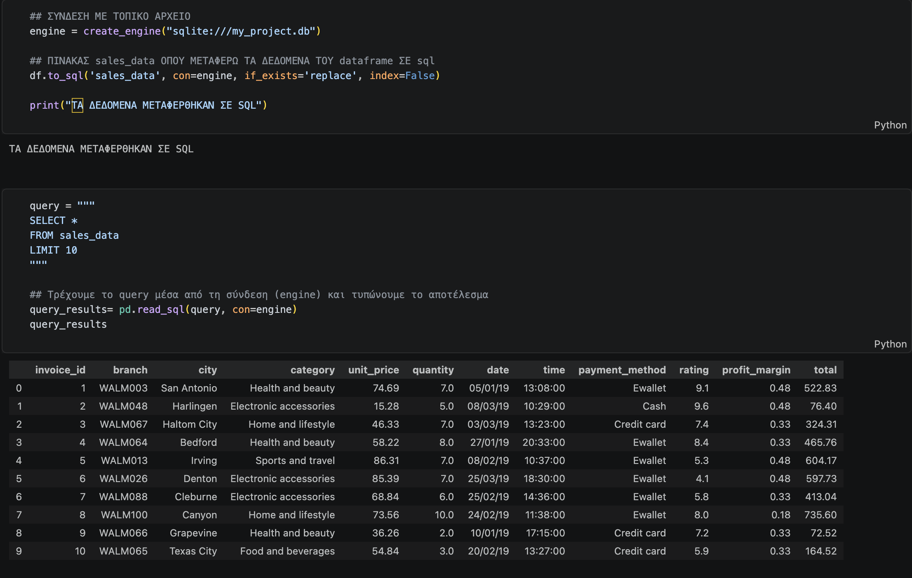
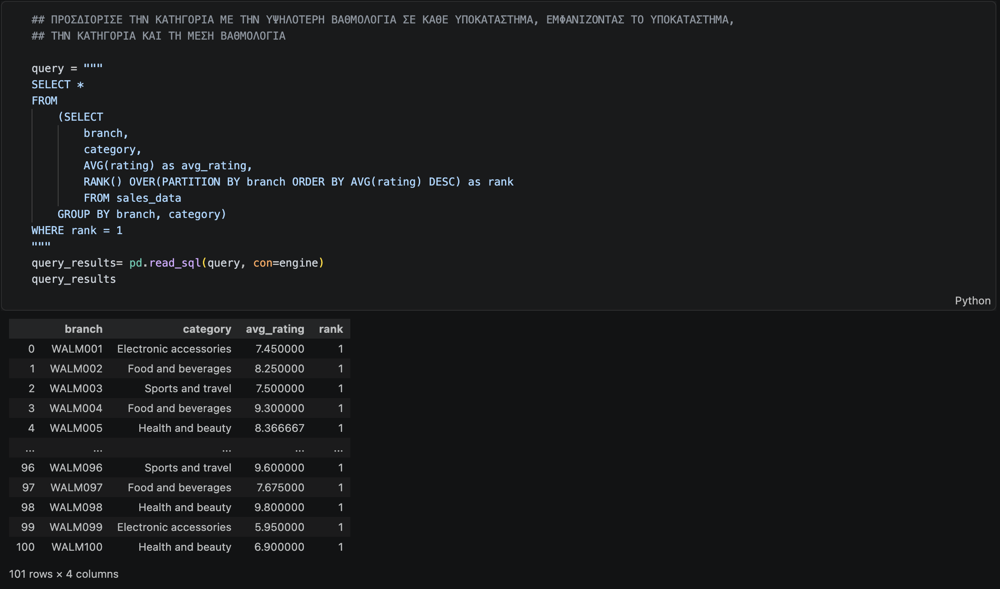
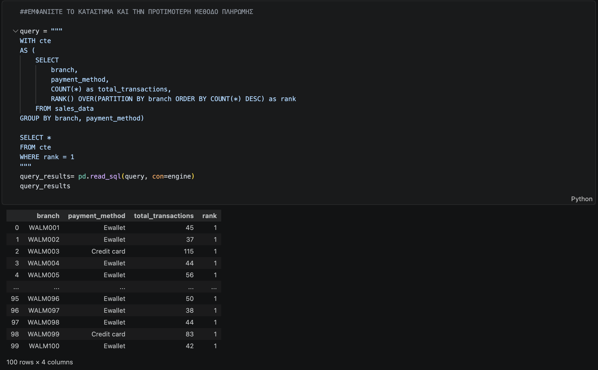

# Walmart Sales Data Analysis

An end-to-end data analysis project that extracts actionable business insights from Walmart sales data using Python for data cleaning and processing, and SQLite for advanced SQL querying. This project demonstrates structured problem-solving, data pipeline design, and the translation of raw transactional data into strategic business recommendations.

## Overview

This repository contains a complete data analysis workflow, from raw data ingestion through cleaning, transformation, database loading, and advanced SQL analysis. The goal is to identify patterns in customer behavior, payment preferences, and product performance that can inform branch-level operational and inventory decisions.

### Database Loading and Verification


### Identifying Top Categories via Window Functions


### Analyzing Payment Preferences via CTEs


## Tech Stack

- Python (Pandas)
- SQLAlchemy
- SQLite
- Jupyter Notebook
- Visual Studio Code

## Project Structure

```
.
├── data_raw/             # Original Walmart.csv dataset
├── aueb.ipynb            # Main notebook containing all Python and SQL code
├── README.md             # Project documentation
├── requirements.txt      # Python dependencies
└── .gitignore            # Excludes local database and virtual environment files
```

Note: the database file `my_project.db` and the virtual environment are excluded via `.gitignore` and are generated locally upon running the notebook.

## Methodology

### 1. Environment Setup

A dedicated virtual environment (`my_venv`) was created to isolate project dependencies and ensure a consistent, reproducible development environment.

### 2. Data Acquisition

The raw Walmart sales dataset was sourced and stored in the `data_raw/` directory for direct access from the analysis notebook.

### 3. Dependency Installation

Core libraries were installed via:

```bash
pip install pandas sqlalchemy jupyter
```

All dependencies are documented in `requirements.txt`.

### 4. Exploratory Data Analysis

Initial exploration was conducted using Pandas methods such as `.info()`, `.describe()`, and `.shape` to assess data structure, column types, and overall quality. The raw dataset consisted of 10,051 rows across 11 columns.

### 5. Data Cleaning

The following steps were applied to prepare the dataset for analysis:

- Standardized all column names to lowercase for consistent querying
- Identified and removed 51 exact duplicate records
- Removed 31 rows with missing values in the `unit_price` and `quantity` columns
- Cleaned the `unit_price` column by stripping the currency symbol and converting it from a string to a `float64` type

The resulting cleaned dataset contains 10,020 records.

### 6. Feature Engineering

A new `total_amount` column was derived by multiplying `unit_price` by `quantity`, simplifying downstream aggregation and revenue analysis in SQL.

### 7. Database Integration

The cleaned dataset was loaded into a local SQLite database (`my_project.db`) using SQLAlchemy. The table `sales_data` was created and populated directly from the processed Pandas DataFrame, requiring no external server configuration.

### 8. SQL Analysis

Advanced SQL queries were written and executed within the notebook to answer key business questions, applying aggregations, common table expressions (CTEs), and window functions (`RANK() OVER`).

Questions addressed include:

- Transaction volumes and total quantities sold by payment method
- The highest-rated product category for each branch
- Minimum, maximum, and average category ratings across cities
- The most preferred payment method per branch

## Key Findings and Business Recommendations

**Digital payment dominance**
Credit card and e-wallet transactions significantly outnumber cash transactions (over 8,000 digital versus fewer than 2,000 cash). This suggests an opportunity to invest in mobile payment loyalty programs and expand digital self-checkout infrastructure.

**Branch-level inventory optimization**
Window function analysis revealed that product category preferences vary significantly by location. For example, Branch WALM001 shows a strong preference for Electronics, while WALM002 favors Food and Beverages. A uniform national stocking strategy may be suboptimal; branch-specific inventory planning is recommended.

**Quality assurance targeting**
Tracking minimum, maximum, and average ratings by city and category enables regional managers to identify localized issues in supply chain quality or customer service, allowing for more targeted interventions.

**Checkout experience optimization**
Understanding the dominant payment method at each branch supports better staffing decisions and terminal allocation at the point of sale.

## Getting Started

### Prerequisites

- Python 3.8 or higher
- pip

### Installation

Clone the repository:

```bash
git clone https://github.com/cbouzios/walmart_analysis_pythontosql/
```

Create and activate a virtual environment, then install the required dependencies:

```bash
pip install -r requirements.txt
```

### Usage

Open `walmart_analysis.ipynb` in VS Code or Jupyter Notebook and run all cells from top to bottom. The notebook will automatically read the source CSV, clean and transform the data, populate the SQLite database, and output the results of all SQL analyses.